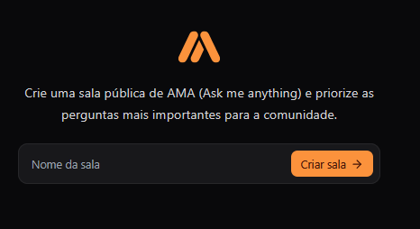
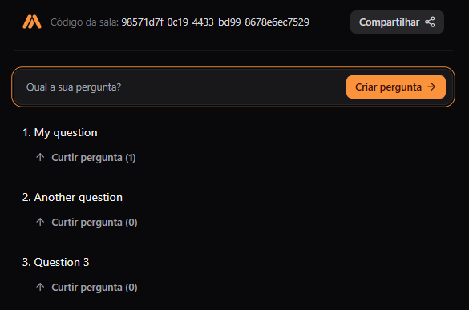
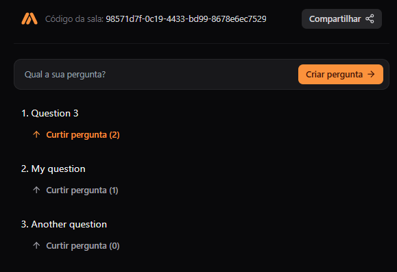

# 🎯 Go React AMA Application

> A real-time Ask Me Anything (AMA) platform built with Go backend and React frontend, featuring WebSocket communication for live interactions.

[](https://golang.org/)
[](https://reactjs.org/)
[](https://www.typescriptlang.org/)
[](https://postgresql.org/)
[](https://www.docker.com/)

---

## 📸 Application Screenshots

### 🏠 Home Page - Room Creation


*Create a new AMA room by entering a theme or topic*

### 💬 Room Interface - Question Management


*Ask questions and interact with the community in real-time*

### 🔄 Real-time Updates - Live Reactions


*Questions automatically reorder based on community reactions*

---


## 🚀 Features

### Core Functionality
- **🏠 Room Management** - Create and join themed AMA rooms
- **💬 Real-time Messages** - Live question posting and updates
- **👍 Reaction System** - Upvote questions to prioritize them
- **🔄 Live Updates** - WebSocket-powered real-time synchronization
- **📱 Responsive Design** - Works on desktop and mobile devices

### Technical Features
- **🔐 UUID-based Identification** - Secure room and message identification
- **🗄️ PostgreSQL Database** - Reliable data persistence
- **🔄 Database Migrations** - Automated schema management with Tern
- **🐳 Docker Support** - Easy development environment setup
- **📡 RESTful API** - Clean HTTP endpoints for all operations
- **🔌 WebSocket Integration** - Real-time bidirectional communication

---

## 🏗️ Project Structure

```
📦 go-react-ask-app
├── 📁 server/                           # Go Backend
│   ├── 📁 cmd/
│   │   ├── 📁 tools/terndotenv/         # Migration tool
│   │   └── 📁 wsrs/                     # Main server
│   ├── 📁 internal/
│   │   ├── 📁 api/                      # HTTP handlers and WebSocket
│   │   └── 📁 store/pgstore/            # Database layer
│   │       ├── 📁 migrations/           # SQL migrations
│   │       └── 📁 queries/              # SQL queries
│   ├── 📄 docker-compose.yml            # Development database
│   ├── 📄 go.mod                        # Go dependencies
│   └── 📄 .env                          # Environment variables
└── 📁 web/                              # React Frontend
    ├── 📁 src/
    │   ├── 📁 components/               # React components
    │   ├── 📁 pages/                    # Page components
    │   ├── 📁 hooks/                    # Custom hooks
    │   ├── 📁 http/                     # API client functions
    │   └── 📁 lib/                      # Utilities
    ├── 📄 package.json                  # Node dependencies
    └── 📄 index.html                    # HTML entry point
```

---

## 🛠️ Tech Stack

### Backend (Go)
| Technology | Purpose |
|------------|---------|
| **Go 1.21+** | Primary backend language |
| **Chi Router** | HTTP routing and middleware |
| **Gorilla WebSocket** | WebSocket implementation |
| **PostgreSQL** | Primary database |
| **PGX** | PostgreSQL driver |
| **SQLC** | Type-safe SQL code generation |
| **Tern** | Database migration tool |
| **UUID** | Unique identifier generation |

### Frontend (React)
| Technology | Purpose |
|------------|---------|
| **React 19** | UI library |
| **TypeScript** | Type safety |
| **Vite** | Build tool and dev server |
| **Tailwind CSS** | Styling framework |
| **React Router** | Client-side routing |
| **TanStack Query** | Server state management |
| **Sonner** | Toast notifications |
| **Lucide React** | Icon library |

---

## 📋 Prerequisites

- **Go 1.21+** 
- **Node.js 18+** and **npm**
- **PostgreSQL 13+** (or use Docker)
- **Tern** migration tool: `go install github.com/jackc/tern/v2@latest`
- **SQLC** code generator: `go install github.com/sqlc-dev/sqlc/cmd/sqlc@latest`

---

## 🚀 Getting Started

### 1. Clone the Repository
```bash
git clone https://github.com/kevinfjq/go-react-ask-app.git
cd go-react-ask-app
```

### 2. Database Setup

#### Option A: Using Docker (Recommended)
```bash
cd server
docker-compose up -d
```
This will start:
- PostgreSQL on port 5432
- pgAdmin on port 8081 (admin@admin.com / password)

#### Option B: Local PostgreSQL
Install PostgreSQL locally and create a database named `wsrs`.

### 3. Environment Configuration
The server uses environment variables defined in `server/.env`:
```env
WSRS_DATABASE_PORT=5432
WSRS_DATABASE_USER="postgres"
WSRS_DATABASE_PASSWORD="123456789"
WSRS_DATABASE_DB="wsrs"
WSRS_DATABASE_HOST="localhost"
```

### 4. Backend Setup
```bash
cd server

# Generate database code and run migrations
go generate ./...

# Install dependencies
go mod tidy

# Run the server
go run cmd/wsrs/main.go
```

The server will start on `http://localhost:8080`

### 5. Frontend Setup
```bash
cd web

# Install dependencies
npm install

# Create environment file
echo "VITE_APP_API_URL=http://localhost:8080/api" > .env.local

# Start development server
npm run dev
```

The frontend will start on `http://localhost:5173`

---

## Usage

### Creating a Room
1. Navigate to the homepage
2. Enter a theme/topic for your AMA room
3. Click "Criar sala" (Create Room)
4. Share the room URL with participants

### Participating in a Room
1. Join a room via shared URL
2. Ask questions using the message form
3. Upvote interesting questions
4. Questions are automatically sorted by reaction count
5. Room moderators can mark questions as answered

### Real-time Features
- New messages appear instantly
- Reaction counts update in real-time
- All updates are synchronized across all connected clients

---

## 🔧 Development

### Database Migrations
```bash
cd server

# Create a new migration
tern new migration_name --migrations ./internal/store/pgstore/migrations

# Run migrations manually
go run cmd/tools/terndotenv/main.go
```

### Code Generation
```bash
cd server

# Generate all code (migrations + SQLC)
go generate ./...

# Generate only SQLC code
sqlc generate -f ./internal/store/pgstore/sqlc.yaml
```

### API Endpoints

#### Rooms
- `POST /api/rooms` - Create a new room
- `GET /api/rooms` - List all rooms

#### Messages
- `POST /api/rooms/{room_id}/messages` - Create a message
- `GET /api/rooms/{room_id}/messages` - Get room messages
- `GET /api/rooms/{room_id}/messages/{message_id}` - Get specific message
- `PATCH /api/rooms/{room_id}/messages/{message_id}/react` - Add reaction
- `DELETE /api/rooms/{room_id}/messages/{message_id}/react` - Remove reaction
- `PATCH /api/rooms/{room_id}/messages/{message_id}/answer` - Mark as answered

#### WebSocket
- `GET /subscribe/{room_id}` - WebSocket connection for real-time updates

---

## 📊 Database Schema

### Tables
- **rooms**: Stores AMA room information
  - `id` (UUID, Primary Key)
  - `theme` (VARCHAR, Room topic)

- **messages**: Stores questions and answers
  - `id` (UUID, Primary Key)
  - `room_id` (UUID, Foreign Key)
  - `message` (VARCHAR, Question text)
  - `reaction_count` (BIGINT, Upvote count)
  - `answered` (BOOLEAN, Answered status)

---

## 🔍 Key Features Explained

### WebSocket Communication
The application uses WebSocket for real-time updates:
- Client connects to `/subscribe/{room_id}`
- Server broadcasts message events to all room subscribers
- Events include: message creation, reactions, and answer marking

### State Management
- **Backend**: In-memory subscriber management with mutex synchronization
- **Frontend**: TanStack Query for server state with WebSocket updates

### Security Considerations
- CORS configured for development
- UUID-based resource identification
- Input validation on all endpoints
- Prepared statements prevent SQL injection

---

## 📝 Environment Variables

### Backend (.env)
```env
WSRS_DATABASE_PORT=5432
WSRS_DATABASE_USER=postgres
WSRS_DATABASE_PASSWORD=123456789
WSRS_DATABASE_DB=wsrs
WSRS_DATABASE_HOST=localhost
```

### Frontend (.env.local)
```env
VITE_APP_API_URL=http://localhost:8080/api
```
